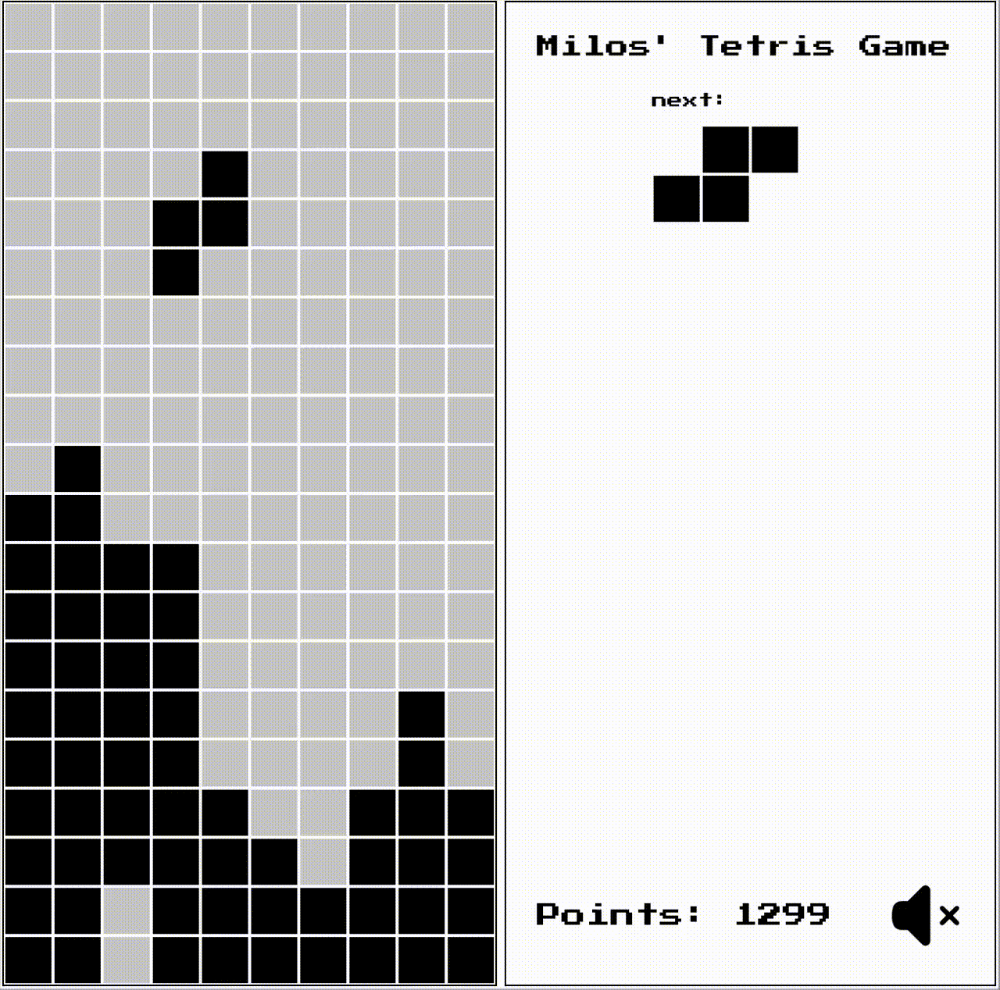

# Retro Tetris (React.js)



# Overview

A classic Tetris game fully implemented using React.js. This project served as a hands-on exercise to deepen my understanding of frontend development concepts, state management patterns, and building dynamic user interfaces within a Single Page Application. The focus was on clean code, modularity, and implementing core Tetris mechanics from scratch.

# Technologies Used

* **Frontend:** React.js (JavaScript, HTML, CSS)
* **State Management:** React Hooks (useState, useEffect, useRef)
* **Styling:** CSS

# Key Features
* **Classic Gameplay:** All familiar Tetris mechanics including falling blocks, line clearing, rotation, and collision detection.
* **Score System:** Points awarded for cleared lines.
* **Level Progression:** Increasing difficulty through faster block drops.
* **"Next Piece" Preview:** Displays the upcoming Tetromino.
* **Keyboard Controls:** Intuitive keyboard navigation for controlling the Tetrominos.
* **Clean and Modular Codebase:** Structured component architecture designed for easy maintenance and future extensibility.

# Installation & Local Setup

To get a local copy up and running, follow these simple steps:

1. Clone the repository:

```
git clone https://github.com/MilosDenck/tetris.git
cd tetris-project
```

2. Install dependencies:

```
npm install
```

3. Start the development server:

```
npm run dev
```
 The game should now be accessible in your web browser at http://localhost:3000 

# Live Demo

Play Retro Tetris directly in your browser:
https://tetris.milosdenck.de/

# Lessons Learned & Key Takeaways
This project provided an excellent opportunity to solidify my understanding of React.js and advanced frontend development techniques. Specific areas of focus included:

* **Complex State Management:** Tackling the challenge of efficiently and performantly managing the game board state, falling blocks, and score.
* **Rendering Optimization:** Ensuring smooth gameplay even during fast-paced sequences through effective state management and the strategic use of useCallback and useMemo.
* **Algorithm Implementation:** Writing core algorithms for collision detection, line clearing, and block rotation.
* **Clean Code Principles:** Emphasizing readability, maintainability, and a modular component architecture.
Contact

## License

All code is the property of Milos Denck. This Code is just for demostration and not for commercial usage. Feel free to be inspired by my code.
